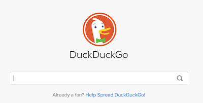

name:inverse
layout: true
class: center, middle, inverse
---

template: inverse

class: center, middle

# Creative Coding for the Web
## Session 07
## 10.09.15

---
layout: false

.left-column[
	# Agenda
]

.right-column[
1. What's CoCr this week
2. Reading Discussion
3. Workshop
4. Next Week
]

---
template: inverse

## 1. What's CoCr this week

---

template: inverse

## 2. Reading Discussion

---

layout: false

.left-column[
# The Open Web
]

.right-column[
## What is the open web?
]

--

.right-column[
## What is the closed web?
]

--

.right-column[
## What is the difference between the internet and the web?
]

--

.right-column[
## What is SOPA / PIPA?
]

---

.left-column[
## It's all about protecting innovation
]

.right-column[
### What is the point of intellectual property laws?
"Intellectual Property is a general term for the set of intangible assets owned and legally protected by a company from outside user or implementation without consent."
_- Marsh.com _

Companies profit from IP by leveraging its benefits internally (to increase competitive advantage) or externally through licensing and royalty sharing schemes.

The purpose of IP protection is to encourage innovation and economic growth through the stimulation of an ideas economy. The debate/criticism is when it appears to be used to suffocate what it expresses to be protecting.
]

---
.left-column[
## "Industry Rule #4080"
]

.right-column[
## (Un)Happy Birthday
[Happy Birthday](http://www.latimes.com/local/lanow/la-me-ln-happy-birthday-song-lawsuit-decision-20150922-story.html)
]
--

.right-column[
## Pharrel Ain't Happy
[Pharrel :-( ](http://www.businessinsider.com/pharrell-made-only-2700-in-songwriter-royalties-from-43-million-plays-of-happy-on-pandora-2014-12)
]

--

.right-column[
## Taylor Swift the Activist
[Taylor Swift, WSJ](http://www.wsj.com/articles/for-taylor-swift-the-future-of-music-is-a-love-story-1404763219)
]

???

The Taylor Swift article is a nice segue to our discussion about open versus closed web.

---

.left-column[
## The Open/Closed Web
]

.right-column[

"The Web was meant to be Free. It laid out a language of HyperText, which anyone could use to author electronic documents and connect them together with links. The documents in totum were meant to form a global web of information with no center and no single point of control."

-Floss Manuals

]

---

.left-column[
# Open Web 
## Tools & Initiatives
]

.right-column[

## Science / Publication
* [Public Library of Science](http://plos.org)
* [FLOSS](http://en.flossmanuals.net/)  
	*[Digital Foundations](http://en.flossmanuals.net/digital-foundations/) 
* [Living Books about Life](http://www.livingbooksaboutlife.org/)

]

---

.left-column[
# Open Web 
## Tools & Initiatives
]

.right-column[
## Civics
* [Open Data Institute](http://theodi.org)
* [Open Government](https://www.data.gov/)
	* [LA Open Govt](https://data.lacity.org/)
]

---

.left-column[
# Open Web 
## Tools & Initiatives
]

.right-column[
## Journalism

* [LA Times Data Desk](https://github.com/datadesk)
* [The Guardian](http://open-platform.theguardian.com/)
* [The NY Times](http://developer.nytimes.com/)
]

---

.left-column[
# Open Web 
## Tools & Initiatives
]

.right-column[
## Software
* [Linux](http://linuxfoundation.org)
* [GNU](http://gnu.org)
* Authoring Tools
	* [Blender](http://blender.org)
	* [Gimp](http://gimp.org)
	* [Inkscape](http://inkscape.org)
	* [Krita](http://krita.org)
]

---

.left-column[
# Open Web 
## Tools & Initiatives
]

.right-column[
## Models
* [Kickstarter](http://kickstarter.com)
* [SmallKnot](http://smallknot.com/)
* [Indie Go Go](http://www.indiegogo.com)
* [Gambitious](http://gambitious.com/)
]

---

.left-column[
# Open Web 
## Tools & Initiatives
]

.right-column[
## Hardware
* [X Carve](https://www.inventables.com/technologies/x-carve)
* [EventorBot](http://eventorbot.com/)
]

---

.left-column[
# API
## Gateway to innovation
]

.right-column[
"Blame Us...The applications that account for more of the Internet’s traffic include peer-to-peer file transfers, email, company VPNs, the machine-to-machine communications of APIs, Skype calls, World of Warcraft and other online games, Xbox Live, iTunes, voice-over-IP phones, iChat, and Netflix movie streaming. Many of the newer Net applications are closed, often proprietary, networks."

-The Web is Dead. Long Live the Internet

]

---

.left-column[
# API
## Gateway to innovation
]

.right-column[
## Not all Bad

API's are not inherently bad. In fact, API's contribute to the 'standards' and 'protocols of access' that contribute to the stability of the web and promote innovation.

]

---
.left-column[
# What is an API
]

.right-column[
## Application Program Interface

A server hosts an application that has a set of functionality. The developers of the application expose a subset of that functionality to users...

]

---
.left-column[
# APIs in Action
]

.right-column[
## Tons of APIs
There are tons of APIs available for all types of applications:  
* [Open Government](https://www.data.gov/)
* [LA Open Govt](https://data.lacity.org/)
* [The Guardian](http://open-platform.theguardian.com/)
* [The NY Times](http://developer.nytimes.com/)
]

---
.left-column[
# Getting Started
]

.right-column[
## Finding APIs
* [Programmable Web](http://programmableweb.com)   
* Search for developers, API on a site of interest  
	* e.g 'etsy developer api'
]

---
.left-column[
# Getting Started
]

.right-column[
## Getting Started
Most sites have usable and friendly instructions for accessing their APIs.  
There are 3 main types of API access with increasing levels of authentication:

* No Access required  
	Increasingly less common. You specify the URL and the data is returned in a format typically JSON or XML. Read the author's site for details on the data fields.

]

--

.right-column[
* API Keys  
	You register for a, typically free, application ID. When you make requests to the API (i.e. send URLs to the server) you must pass in the API key with the request.  
	Often times the number of requests that you are able to make per some specified time frame are limited. The API key allows the API authors to track the applciations that are making requests.

]

---
.left-column[
# Getting Started
]

.right-column[

* Authentication
	You obtain a key much like above. In addition you will receive additional authentication details for security. When you make requests either for your application or on behalf of users to your application the additional authentication will be required.  

	_if you end up needing this type of API for your work we can address that separately_
]

---

.left-column[
# Getting Started
]

.right-column[
Typically the Authors will provide details about:
 - the types of requests that you can make to the API
 - the format of the data that is returned
 - an example of properly formatted requests
]

---

template: inverse

## 3. Workshop

---
layout: false

.left-column[
# Helpful Tools
]

.right-column[
## Helpful! Chrome Extensions

* [Allow Control Allow Origin](https://chrome.google.com/webstore/detail/allow-control-allow-origi/nlfbmbojpeacfghkpbjhddihlkkiljbi/related?hl=en-US)

* [Postman](https://chrome.google.com/webstore/detail/postman-rest-client/fdmmgilgnpjigdojojpjoooidkmcomcm)

## Non Chrome Tools
* [cURL](https://en.wikipedia.org/wiki/CURL)
	* [Using cURL](http://curl.haxx.se/docs/manual.html)
	* [HTTP Scripting with cURL](http://curl.haxx.se/docs/httpscripting.html)
		* Longer length overview of using cURL to surf the nets and explore HTTP.
]

---

.left-column[
# API Test Driving
]

.right-column[
## Google Maps API

[Google Maps](https://developers.google.com/maps/documentation/javascript/)  

We will follow the instructions on the site to get the API setup.  
There is a simple example of using the [Google Distance Matrix API](https://developers.google.com/maps/documentation/distance-matrix/intro) on Github.

]

---

template: inverse

## 4. Next week

---

layout: false

.left-column[
# For next week
]

.right-column[
## Coding

* Using your new found knowledge of the treasure trove of web API resources create a simple, but insightful and creative, web page that provides a UI to interact with your chosen API.

* Aim for simple and clever not complicated and obfuscated!

## Reading
* [The New Aesthetic](http://www.wired.com/2012/04/an-essay-on-the-new-aesthetic/)

## Handin-
1. Written response to the videos and readings
2. Your web page loaded onto to Storm

]

